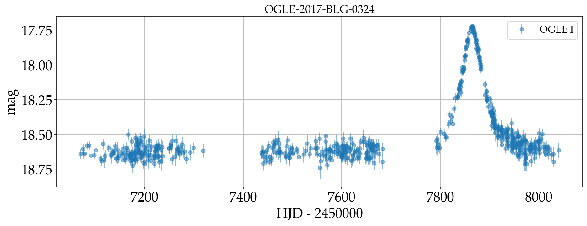
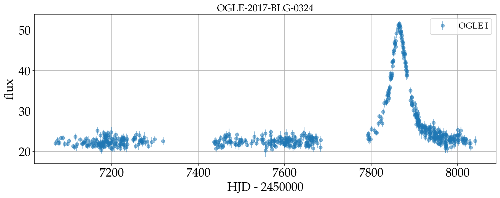
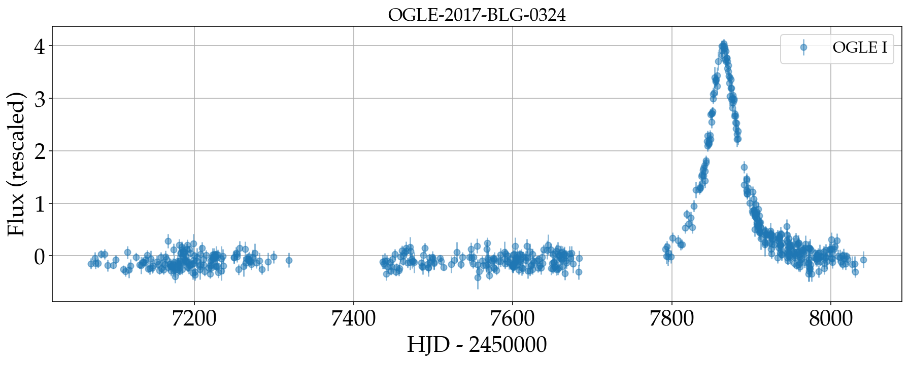
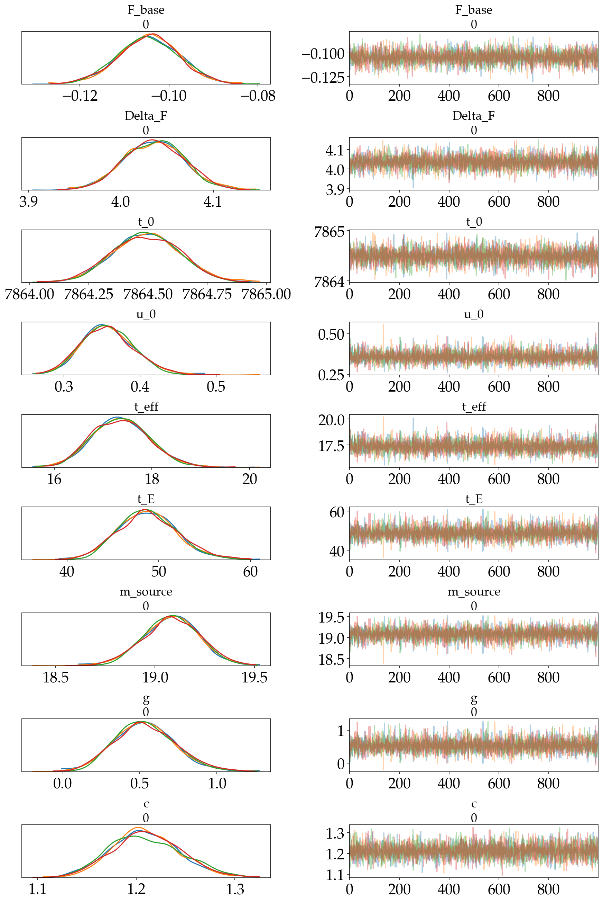
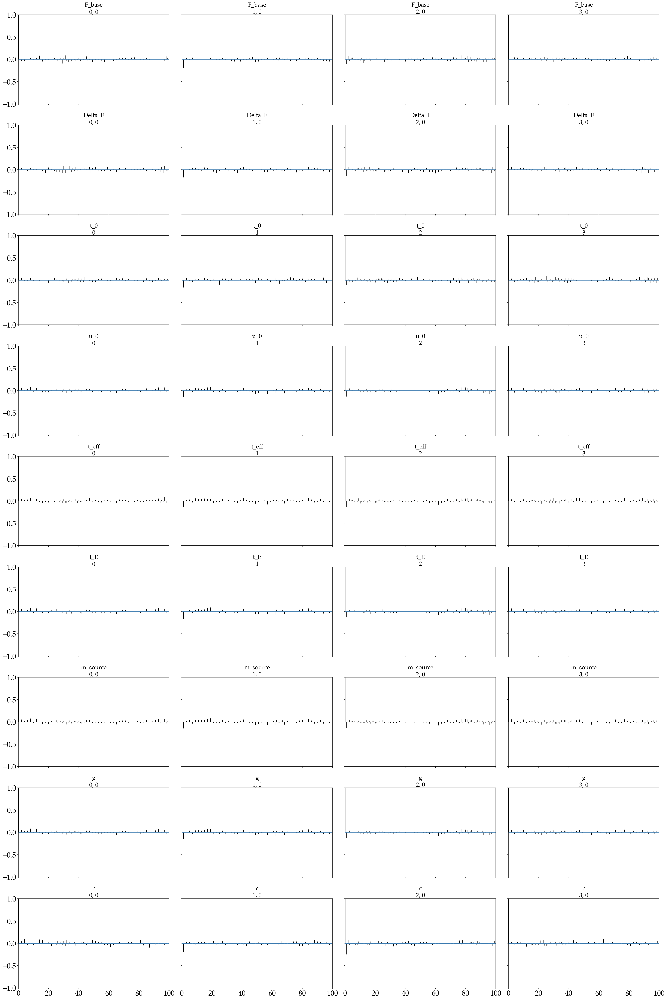
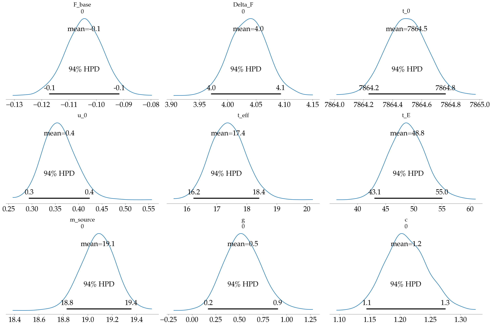
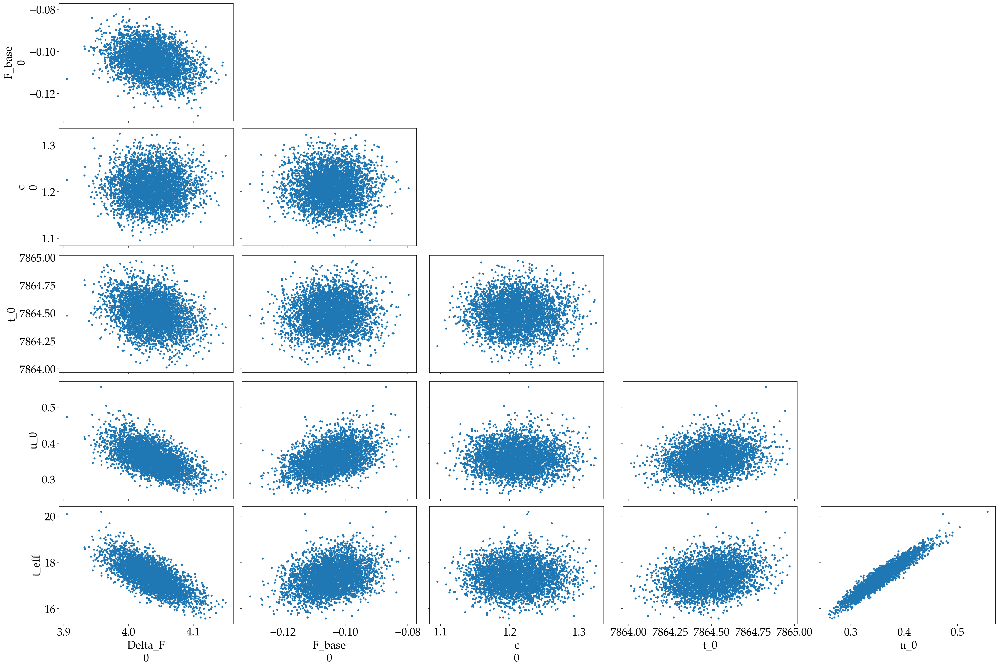
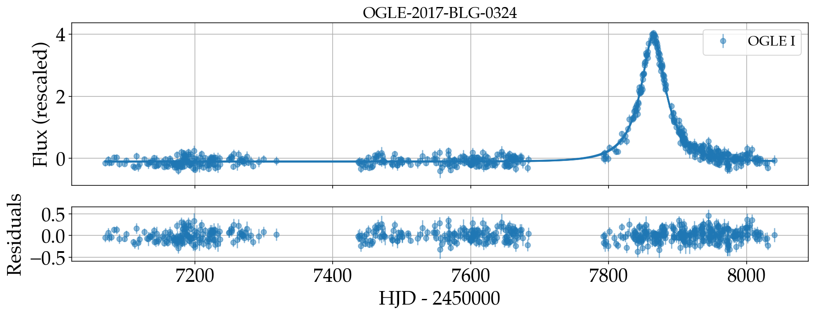
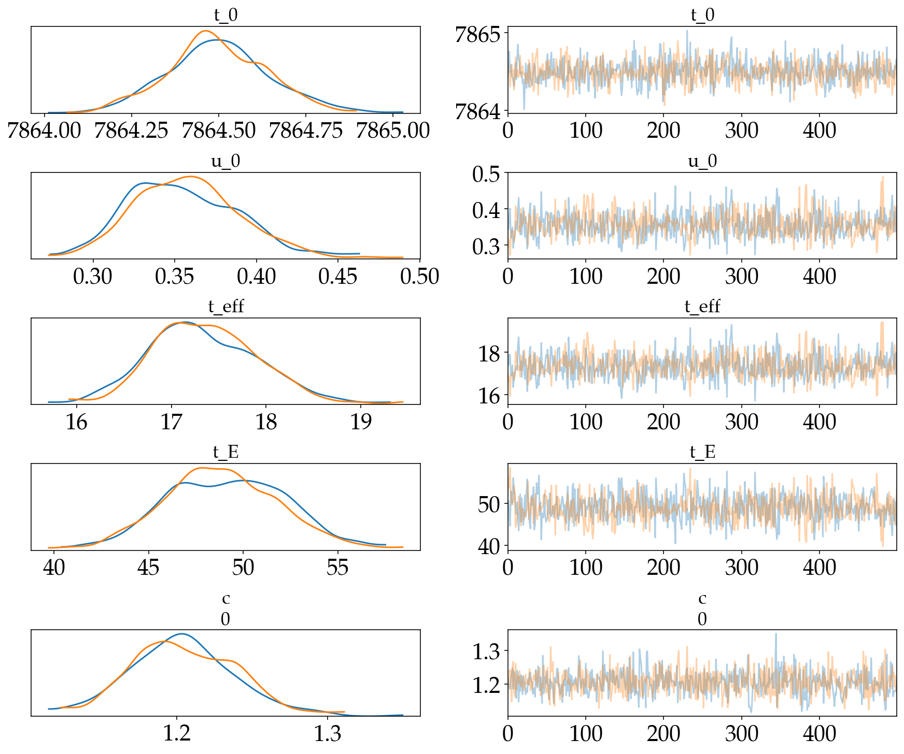
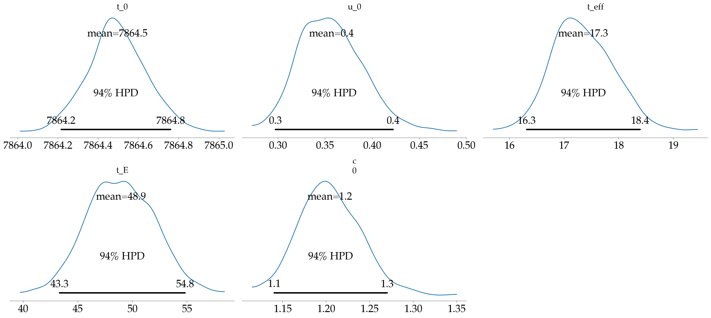

.. code:: ipython3

    import numpy as np
    from matplotlib import pyplot as plt
    import matplotlib as mpl
    import sys
    sys.path.append('../../')
    
    mpl.rcParams['axes.labelsize'] = 22
    mpl.rcParams['xtick.labelsize'] = 22
    mpl.rcParams['ytick.labelsize'] = 22
    mpl.rcParams['axes.titlesize'] = 22
    
    %config InlineBackend.figure_format = 'retina'
    
    np.random.seed(42)

``caustic`` is code for probabilistic modeling of single lens
gravitational microlensing events. It is designed primarily to serve as
a testbed for new approaches to modeling microlensing events rather than
something that can be used in existing pipelines. ``caustic`` is built
on top of the probabilistic programming language ``PyMC3`` which is used
in many fields for the purporse of building and testing Bayesian models.
The main feature of PyMC3 is that it enables the use of Hamiltonian
Monte Carlo (HMC) via the No U-Turn Sampler (NUTS). HMC enables
efficient sampling of high dimensional probabilistic models by utilizing
the gradients of the log probability with respect the model parameters.
These gradients are obtained through `automatic
differentiation <https://en.wikipedia.org/wiki/Automatic_differentiation>`__,
a method widely used in machine learning to obtain *exact* gradientss of
computer code by repeatedly apply the chain rule from calculus.

Automatic differention (AD) is different from symbolic differentiation
(like for example in Wolfram Mathematica) and the finite difference
method used in numerical solvers for differential equations. Automatic
differentiation is not trivial to do so one usually relies existing
libraries which implement it. ``PyMC3`` uses ``Theano`` under the hood.
You can think of Theano as a sort of compiler that takes code written in
Python, compiles it to ``C``, builds a graph of all mathematical
computations in the code and propagates the gradients through every node
in the graph using reverse mode automatic differentiation
(`backpropagation <https://en.wikipedia.org/wiki/Backpropagation>`__).
``Theano`` is best known today as a predecessor to ultra popular machine
learning libraries ``Tensorflow`` and ``PyTorch`` whose main purpose is
also automatic differentiation. Because of the requirement that all
models written in ``PyMC3`` have to be compliant with ``Theano``,
building physical models is somewhat more complicated than if we were to
use ``numpy``, although the API is very similar.

Check out the `PyMC3
docs <https://docs.pymc.io/notebooks/api_quickstart.html>`__ for an
introduction to ``PyMC3`` and probabilistic programming, `docs on
Theano <http://deeplearning.net/software/theano/introduction.html>`__
for an overview of Theano, and the very recent
`exoplanet <https://exoplanet.dfm.io/en/latest/>`__ code for building
differentiable astrophysical models on top of ``PyMC3`` in the context
of explanet transits and radial velocity measurements. ``caustic`` is
very similar to ``exoplanet`` and uses it as a dependancy.

In this notebook, I’ll walk you through loading a microlensing dataset
and fitting a simple model with ``caustic``.

Loading microlensing datasets
=============================

All of the data handling is done using the ``caustic.data`` module. The
purpose of the module is to take raw lightcurves provided by an
observatory or collaboration and transform it into a common format which
can then used within a context of a ``PyMC3`` model for inference.
Here’s an example where we load an OGLE light curve using the
``caustic.data.OGLEData`` class.

.. code:: ipython3

    import caustic as ca
    
    event_ogle = ca.data.OGLEData("../../data/OGLE-2017-BLG-0324")

The data is stored as a list of ``astropy.table.Table`` tables, each
table corresponds to one time series observation in a certain band.

.. code:: ipython3

    event_ogle.light_curves

.. parsed-literal::

    [<Table length=626>
          HJD        mag   mag_err mask
        float64    float64 float64 bool
     ------------- ------- ------- ----
     2457069.87628   18.64   0.035 True
     2457074.88664  18.604   0.038 True
     2457075.86271  18.639   0.036 True
     2457078.86521  18.638   0.031 True
     2457082.86705   18.58   0.026 True
     2457086.89543   18.58   0.032 True
     2457090.82554  18.652   0.039 True
      2457097.8947   18.65   0.023 True
     2457100.87989  18.614   0.028 True
     2457110.80722  18.677   0.027 True
               ...     ...     ...  ...
     2458014.55412  18.645   0.034 True
     2458015.55245  18.586   0.041 True
     2458016.56098  18.607   0.036 True
      2458018.4914  18.641   0.039 True
     2458019.52922  18.593   0.027 True
     2458020.56318  18.613   0.034 True
     2458026.52622  18.645   0.052 True
      2458029.5112  18.641   0.049 True
     2458030.51879  18.696   0.039 True
     2458040.49979  18.614   0.055 True]

Each table contains metadata information about the observatory and
filter used

.. code:: ipython3

    for table in event_ogle.light_curves:
        print(table.meta)

.. parsed-literal::

    {'filter': 'I', 'observatory': 'OGLE'}

Plotting the data is straightforward

.. code:: ipython3

    fig, ax = plt.subplots(figsize=(15, 5))
    event_ogle.plot(ax)

The times of observation are specified in Helocentric Julian Days (HJD),
the source brightness is either units of magnitudes or flux (defined
such that a magnitude of 22 corresponds to unit flux).

.. code:: ipython3

    event_ogle.units = 'fluxes'

.. code:: ipython3

    fig, ax = plt.subplots(figsize=(15, 5))
    event_ogle.plot(ax)

The coordinates of an event are stored as a
``astropy.coordinates.SkyCoord`` object

.. code:: ipython3

    event_ogle.event_coordinates

.. parsed-literal::

    <SkyCoord (ICRS): (ra, dec) in deg
        ( 264.61391667, -29.90372222)>

You can also get the data in a standardized format where all light
curves are converted to fluxes and standardized to zero median and unit
variance

.. code:: ipython3

    standardized_data = event_ogle.get_standardized_data()
    standardized_data

.. parsed-literal::

    [<Table length=626>
        HJD            flux           flux_err   
      float64        float64          float64    
     ---------- ----------------- ---------------
     7069.87628   -0.146581222379  0.101194880196
     7074.88664  -0.0404763560482  0.113588563846
     7075.86271   -0.143594760276  0.104186780064
     7078.86521   -0.141146881047  0.089779925443
     7082.86705    0.030960028291 0.0794167559969
     7086.89543   0.0314495066675 0.0977653441168
     7090.82554   -0.180686906212  0.111541606797
      7097.8947   -0.176271671295 0.0658606499698
     7100.87989  -0.0711215388054 0.0828946818377
     7110.80722   -0.252367129576 0.0754253274367
            ...               ...             ...
     8014.55412   -0.161092076113 0.0978476380807
     8015.55245   0.0140922362723  0.124623619075
     8016.56098  -0.0496318551675  0.107303185788
      8018.4914   -0.149076743775   0.11267742054
     8019.52922 -0.00843225890283 0.0814924180113
     8020.56318  -0.0676525458059  0.100774429169
     8026.52622   -0.159040327379  0.149796801571
      8029.5112   -0.147906054621  0.141648358105
     8030.51879   -0.303973138311  0.107111696102
     8040.49979  -0.0680652781855  0.163061184926]

.. code:: ipython3

    fig, ax = plt.subplots(figsize=(15, 5))
    event_ogle.plot_standardized_data(ax)

It’s possible to add different datasets together

Fitting a simple model
======================

All models we build with ``caustic`` are just ``PyMC3`` models, all
``caustic`` does is that it provides some extra functionality specific
to microlensing. The user initializes a base model
``caustic.models.SingleLensModel`` inherits from ``pymc3.model.Model``
class and provides basic functionality such as transforming the data
into ``theano`` tensors and methods for computing the likelihood. One
can then build on that model by initializing ``PyMC3`` random variables
and calling methods for computing the trajectory of the lens and the
resulting magnification.

Let’s first initialize a ``SingleLensModel`` object which takes a
``caustic.data`` object as an input, transforms the data to a
standardized format where all of the light curves are rescaled to zero
median and unit standard deviation and stores the data as theano
tensors. We also need to specify the noise model

.. code:: ipython3

    # Initialize a SingleLensModel object
    pspl_model = ca.models.SingleLensModel(event_ogle) 

The data is stored as one ``theano.tensor`` for time observations
:math:`\{\mathbf{t}_j\}`, fluxes :math:`\{\mathbf{F}_j\}` and reported
uncertainties :math:`\{\boldsymbol{\sigma}_h\}` where :math:`j` goes
over all bands. Since the number of data points for a given light curve
will in general depend on the band :math:`k`, for reasons of
computational efficiency, we stack observations in a single matrix of
shape :math:`(N_\mathrm{bands}, N_\mathrm{max})` where
:math:`N_\mathrm{bands}` is the number of bands and
:math:`N_\mathrm{max}` is the dimension of the light curve with the
greatest number of data points such that the missing values are replaced
by zeros. We keep track of the locations of the missing values by also
storing a masking array of the same dimension.

.. code:: ipython3

    import theano.tensor as T
    
    # Time
    T.shape(pspl_model.t).eval() # .eval() evaluates the theano computation graph

.. parsed-literal::

    array([  1, 626])

.. code:: ipython3

    # Flux
    T.shape(pspl_model.F).eval() # .eval() evaluates the theano computation graph

.. parsed-literal::

    array([  1, 626])

.. code:: ipython3

    # Error bars
    T.shape(pspl_model.sig_F).eval() # .eval() evaluates the theano computation graph

.. parsed-literal::

    array([  1, 626])

.. code:: ipython3

    # Mask
    T.shape(pspl_model.mask).eval() # .eval() evaluates the theano computation graph

.. parsed-literal::

    array([  1, 626])

The model we are going to fit is the simplest in microlensing. It models
the magnification of a background source star by a single point lens
assuming uniform colinear motion between the observer, the lens and the
source. The magnification is then given by the following simple
expression

.. math::

   A(u)=\frac{u^2+2}{u\sqrt{u^2+4}}

where the trajectory :math:`u(t)` is

.. math::

   u(t)=\sqrt{u_0^2+\left(
   \frac{t-t_0}{t_E}\right)^2}

The predicted flux :math:`\mathbf{f}_j` in the :math:`j`-th band is then

.. math::

       
   \mathbf{f}_j=\boldsymbol{\Phi}\,\mathbf w_j

where the matrix :math:`\boldsymbol{\Phi}` is defined by

.. math::

      
   \boldsymbol{\Phi}=\left(\begin{array}{cc}
      {\tilde{A}_{1}\left(t_{1}\right)} & {1} \\
      {\tilde{A}_{2}\left(t_{2}\right)} & {1} \\
      {\vdots} & {\vdots} \\
      {\tilde{A}_{N}\left(t_{N}\right)} & {1}
      \end{array}\right) 

with :math:`\tilde{A}(t)\equiv (A(t)-1)/(A(t_0)-1)` and
:math:`\mathbf{w}_j` is a vector of linear parameters

.. math::

   \mathbf{w}_j=\left(\begin{array}{c}{\Delta F}_j \\
      {F_{\mathrm{base}, j}}\end{array}\right) 

where the parameter :math:`\Delta F_j` represents the difference between
the flux at peak magnification and the baseline flux
:math:`F_\mathrm{base, j}` in the :math:`j`-th band.

We assume that the likelihood function for the :math:`j`-th band is a
multivariate gaussian with mean :math:`\mathbf{f}_j` and a covariance
matrix :math:`\mathbf C`. The likelihood for the time series data in the
:math:`j`-th band is then

.. math::

   p(\mathbf{F}_j|\boldsymbol{\theta})\sim\mathcal{N}(\mathbf{F}_j;
       \mathbf{f}_j,\mathbf{C}_j)

where the symbol :math:`\mathcal{N}` denotes a multivariate normal
distribution. In this example, we take the covariance matrix to be
diagonal

.. math::

   \mathbf{C}_j=\mathrm{diag}\left(\sigma_{1,j}^2, \sigma_{2,j}^2,\dots,\sigma_{N,j}^2\right)

where the elements on the diagonal are the squares of the uncertainties
for each point. In the the ``gaussian_processes`` notebook we relax this
assumption by modelling off diagonal terms with a GP. Since the reported
uncertainties in microlensing are generally underestimated we’ll
introduce a constant rescaling by a parameter :math:`c`

.. math::

   \tilde{\sigma}_{i,j}=c\,\sigma_{i,j}

The total likelihood for data observed in multiple bands is then the
product of the individual likelihoods for each band because the the
noise properties are conditionally independent on the parameters between
the different bands.

.. math::

   p(\{\mathbf{F}\}^{J}_{j=1}|\boldsymbol{\theta})=\prod_{j=1}^J
     p(\mathbf{F}_j|\boldsymbol{\theta})

First, we initialize the linear flux parameters as ``PyMC3`` random
variables. The shape of these parameters has to be
:math:`(N_\mathrm{bands}, 1)`. It’s good practice to make use of the
``testval=`` keyword for every RV in ``PyMC3`` to initialize the RV
because MCMC is extremely sensitive to initial values of the model
parameters.

.. code:: ipython3

    import pymc3 as pm
    
    n_bands = len(event_ogle.light_curves)
    BoundedNormal = pm.Bound(pm.Normal, lower=0.0)
    BoundedNormal_1 = pm.Bound(pm.Normal, lower=1.) 
    
    with pspl_model:
        # Initialize linear parameters   
        Delta_F = BoundedNormal('Delta_F', 
            mu=T.zeros(n_bands),
            sd=50.*T.ones(n_bands),
            testval=5.*T.ones(n_bands),
            shape=(n_bands))
    
        F_base = pm.Normal('F_base', 
            mu=T.zeros(n_bands), 
            sd=0.6*T.ones(n_bands),
            testval=T.zeros(n_bands),
            shape=(n_bands))

To print all free parameters in the model, we do the following

.. code:: ipython3

    pspl_model.vars

.. parsed-literal::

    [Delta_F_lowerbound__, F_base]

The ``_lowerbound__`` and ``_interval__`` words mean that the original
bounded parameters (for example restricted to be positive) have been
transformed using a deterministic transform such that they end up being
defined on the entire domain of real numbers. ``PyMC3`` does this by
default to improve sampling efficiency. In the final trace containing
the samples one can access both the transformed and the original
parameters.

Let’s specify the rest of the model

.. code:: ipython3

    with pspl_model:
        # Initialize non-linear parameters
        ## Posterior is multi-modal in t0 and it's critical that the it is 
        ## initialized near the true value
        t_0 = pm.Uniform('t_0', pspl_model.t_min, pspl_model.t_max,
            testval=ca.utils.estimate_t0(event_ogle))
        
        u_0 = BoundedNormal('u_0', mu=0., sd=1.5, testval=0.1)
        
        teff = BoundedNormal('t_eff', mu=0., sd=365., testval=20.)
        
        # Deterministic transformations
        t_E = pm.Deterministic("t_E", teff/u_0) 
        m_source, g = ca.utils.revert_flux_params_to_nonstandardized_format(event_ogle, Delta_F, F_base, u_0)
        pm.Deterministic("m_source", m_source)
        pm.Deterministic("g", g)
        
        # Compute the trajectory of the lens
        trajectory = ca.trajectory.Trajectory(event_ogle, t_0, u_0, t_E)
        u = trajectory.compute_trajectory(pspl_model.t)
        
        # Compute the magnification
        mag = pspl_model.compute_magnification(u, u_0)
        
        # Compute the mean model
        mean = Delta_F*mag + F_base
        
        # We allow for rescaling of the error bars by a constant factor
        c = BoundedNormal_1('c', 
            mu=T.ones(n_bands),
            sd=2.*T.ones(n_bands),
            testval=1.5*T.ones(n_bands),
            shape=(n_bands))
    
        # Diagonal terms of the covariance matrix
        var_F = (c*pspl_model.sig_F)**2
        
        # Compute the Gaussian log_likelihood, add it as a potential term to the model
        ll = pspl_model.compute_log_likelihood(pspl_model.F - mean, var_F)
        pm.Potential('log_likelihood', ll)

.. code:: ipython3

    pspl_model.vars

.. parsed-literal::

    [Delta_F_lowerbound__,
     F_base,
     t_0_interval__,
     u_0_lowerbound__,
     t_eff_lowerbound__,
     c_lowerbound__]

We’re now ready to sample the model with NUTS. We use Dan
Foreman-Mackey’s modification to the default ``PyMC3`` sampler
``exoplanet.get_dense_nuts_step()`` which includes an improved tuning
schedule. By default, the NUTS implementation in ``PyMC3`` assumes a
diagonal mass matrix. The modified sampling procedure in ``exoplanet``
uses a dense matrix which is tuned in 4 short runs to estimate the
inverse of the covariance matrix of the model parameters. Effectively
this means that the parameter space is rescaled such that the posterior
is as close as possible to a multivariate Gaussian with an identity
matrix as the covariance matrix. For more details of the imporoved
tuning schedule, see `here <https://dfm.io/posts/pymc3-mass-matrix/>`__.

.. code:: ipython3

    import exoplanet as xo
    
    with pspl_model:
        # Print initial logps
        initial_logps = [RV.logp(pspl_model.test_point) for RV in pspl_model.basic_RVs]
        print("Initial values of log priors:", initial_logps)
        
        # Run sampling
        trace = pm.sample(tune=500, draws=1000, cores=4, step=xo.get_dense_nuts_step())

.. parsed-literal::

    Initial values of log priors: [array(-3.226523626198718), array(-0.40811290943868195), array(-1.9090798469309613), array(-3.6292109565291044), array(-3.8246048329742135), array(-2.3364828943245635)]

.. parsed-literal::

    Multiprocess sampling (4 chains in 4 jobs)
    NUTS: [c, t_eff, u_0, t_0, F_base, Delta_F]
    Sampling 4 chains: 100%|██████████| 6000/6000 [00:06<00:00, 857.91draws/s] 
    The acceptance probability does not match the target. It is 0.917326653333, but should be close to 0.8. Try to increase the number of tuning steps.
    The acceptance probability does not match the target. It is 0.91317687182, but should be close to 0.8. Try to increase the number of tuning steps.
    The acceptance probability does not match the target. It is 0.919073536508, but should be close to 0.8. Try to increase the number of tuning steps.
    The acceptance probability does not match the target. It is 0.904761736385, but should be close to 0.8. Try to increase the number of tuning steps.

To check how the sampling turned out, we can use built in methods from
``PyMC3``

.. code:: ipython3

    pm.summary(trace)

.. raw:: html

    

    
    <table border="1" class="dataframe">
      <thead>
        <tr style="text-align: right;">
          <th></th>
          <th>mean</th>
          <th>sd</th>
          <th>mc_error</th>
          <th>hpd_2.5</th>
          <th>hpd_97.5</th>
          <th>n_eff</th>
          <th>Rhat</th>
        </tr>
      </thead>
      <tbody>
        <tr>
          <th>F_base__0</th>
          <td>-0.104518</td>
          <td>0.006742</td>
          <td>0.000086</td>
          <td>-0.117684</td>
          <td>-0.091167</td>
          <td>5775.219066</td>
          <td>0.999590</td>
        </tr>
        <tr>
          <th>Delta_F__0</th>
          <td>4.036066</td>
          <td>0.032439</td>
          <td>0.000475</td>
          <td>3.971145</td>
          <td>4.098353</td>
          <td>5055.680648</td>
          <td>0.999583</td>
        </tr>
        <tr>
          <th>t_0</th>
          <td>7864.494492</td>
          <td>0.142043</td>
          <td>0.001954</td>
          <td>7864.218919</td>
          <td>7864.766999</td>
          <td>5577.122237</td>
          <td>1.000082</td>
        </tr>
        <tr>
          <th>u_0</th>
          <td>0.358080</td>
          <td>0.034814</td>
          <td>0.000536</td>
          <td>0.290066</td>
          <td>0.425068</td>
          <td>4882.827747</td>
          <td>0.999875</td>
        </tr>
        <tr>
          <th>t_eff</th>
          <td>17.372086</td>
          <td>0.580678</td>
          <td>0.008525</td>
          <td>16.265045</td>
          <td>18.527349</td>
          <td>4974.089922</td>
          <td>0.999656</td>
        </tr>
        <tr>
          <th>t_E</th>
          <td>48.821212</td>
          <td>3.223538</td>
          <td>0.049167</td>
          <td>42.833827</td>
          <td>55.427428</td>
          <td>4759.241213</td>
          <td>1.000006</td>
        </tr>
        <tr>
          <th>m_source__0</th>
          <td>19.081654</td>
          <td>0.140522</td>
          <td>0.002138</td>
          <td>18.814974</td>
          <td>19.365813</td>
          <td>4961.465950</td>
          <td>0.999876</td>
        </tr>
        <tr>
          <th>g__0</th>
          <td>0.535063</td>
          <td>0.196442</td>
          <td>0.002950</td>
          <td>0.139560</td>
          <td>0.905589</td>
          <td>4967.179192</td>
          <td>0.999863</td>
        </tr>
        <tr>
          <th>c__0</th>
          <td>1.209871</td>
          <td>0.034580</td>
          <td>0.000512</td>
          <td>1.143927</td>
          <td>1.278791</td>
          <td>5343.656676</td>
          <td>1.000132</td>
        </tr>
      </tbody>
    </table>
    

Not bad, we have thousands of effective samples for less than a minute
of sampling time.

We can also plot a traceplot of the chain

.. code:: ipython3

    pm.traceplot(trace);

The traceplot also includes the deterministic variables we’ve specified
in the model. In this case we’ve added a variable ``m_source``, the
posteior over the source star brightness in magnitudes and the blending
ratio ``g`` which is the ratio of the background flux due to other
unresolved stars in the vicinity of the source star and the source star
flux.

Let’s check the autocorrelation times of the chains

.. code:: ipython3

    pm.autocorrplot(trace);

and plot the posterior means and highest posterior density intervals

.. code:: ipython3

    pm.plot_posterior(trace);

and a corner plot

.. code:: ipython3

    pm.pairplot(trace, var_names=['Delta_F', 'F_base', 'c', 't_0', 'u_0', 't_eff']);

When interpreting this plot, we have to remember that the actual
sampling happens in the sapace of the transformed parameters while the
``pm.pairplot()`` function plots the samples in the original space.

Finally, we can plot posterior realizations of the model in data space.
This is more complicated than it sounds because we have to evaluate the
model prediction which is a ``theano.tensor`` for multiple draws from
the posterior. To do this, we recompute the model prediction tensor for
a denser grid in time, and pass that tensor to the function
``plot_model_and_residuals`` defined in ``caustic.utils``. Internally,
the prediction tensor is then evaluated for different parameter
dictionaries corresponding to different samples from the posterior.

.. code:: ipython3

    with pspl_model:
        # Create dense grid
        t_dense = np.tile(np.linspace(pspl_model.t_min, pspl_model.t_max, 2000), (n_bands, 1))
        t_dense_tensor = T.as_tensor_variable(t_dense) 
        
        # Compute the trajectory of the lens
        u_dense = trajectory.compute_trajectory(t_dense_tensor)
        
        # Compute the magnification
        mag_dense = pspl_model.compute_magnification(u_dense, u_0)
        
        # Compute the mean model
        mean_dense = Delta_F*mag_dense + F_base

.. code:: ipython3

    # Plot model
    fig, ax = plt.subplots(2, 1, gridspec_kw={'height_ratios':[3,1]},
                figsize=(15, 5), sharex=True)
    
    ca.plot_model_and_residuals(ax, event_ogle, pspl_model, trace, t_dense_tensor, mean_dense, n_samples=50)

# Marginalizing over the linear flux parameters

Instead of sampling both in the linear flux parameters, we can
analytically marginalize over them and sample the marginalized
posterior. To do this, we need to call the
``compute_marginalized_likelihood`` method.

.. code:: ipython3

    # Initialize a SingleLensModel object
    pspl_model_marginalized = ca.models.SingleLensModel(event_ogle) 
    
    with pspl_model_marginalized:
        # Initialize non-linear parameters
        t_0 = pm.Uniform('t_0', pspl_model_marginalized.t_min, pspl_model_marginalized.t_max,
            testval=ca.utils.estimate_t0(event_ogle))
        
        u_0 = BoundedNormal('u_0', mu=0., sd=1.5, testval=0.1)
        
        teff = BoundedNormal('t_eff', mu=0., sd=365., testval=20.)
        
        # Deterministic transformations
        t_E = pm.Deterministic("t_E", teff/u_0) 
        
        # Compute the trajectory of the lens
        trajectory = ca.trajectory.Trajectory(event_ogle, t_0, u_0, t_E)
        u = trajectory.compute_trajectory(pspl_model_marginalized.t)
        
        # Compute the magnification
        mag = pspl_model_marginalized.compute_magnification(u, u_0)
        
        # We allow for rescaling of the error bars by a constant factor
        c = BoundedNormal_1('c', 
            mu=T.ones(n_bands),
            sd=2.*T.ones(n_bands),
            testval=1.5*T.ones(n_bands),
            shape=(n_bands))
    
        # Diagonal terms of the covariance matrix
        var_F = (c*pspl_model_marginalized.sig_F)**2
        
        # Prior matrix for the linear parameters
        sig_Delta_F = 20.
        sig_F_base = 0.1
        L_diag = T.as_tensor_variable(np.array([sig_Delta_F, sig_F_base])**2.)
        L = T.nlinalg.diag(L_diag)
    
        # Compute the marginalized log-likelihood  
        ll = pspl_model_marginalized.compute_marginalized_log_likelihood(mag, var_F, L)
        pm.Potential('log_likelihood', ll)

.. code:: ipython3

    pspl_model_marginalized.vars

.. parsed-literal::

    [t_0_interval__, u_0_lowerbound__, t_eff_lowerbound__, c_lowerbound__]

.. code:: ipython3

    with pspl_model_marginalized:
        # Print initial logps
        initial_logps = [RV.logp(pspl_model_marginalized.test_point) for RV in pspl_model_marginalized.basic_RVs]
        print("Initial values of log priors:", initial_logps)
        
        # Run sampling
        trace_marginalized = pm.sample(tune=500, draws=500, cores=2, step=xo.get_dense_nuts_step())

.. parsed-literal::

    Initial values of log priors: [array(-1.9090798469309613), array(-3.6292109565291044), array(-3.8246048329742135), array(-2.3364828943245635)]

.. parsed-literal::

    Multiprocess sampling (2 chains in 2 jobs)
    NUTS: [c, t_eff, u_0, t_0]
    Sampling 2 chains: 100%|██████████| 2000/2000 [13:09<00:00,  5.38draws/s]
    The acceptance probability does not match the target. It is 0.901194414875, but should be close to 0.8. Try to increase the number of tuning steps.
    The acceptance probability does not match the target. It is 0.912614301126, but should be close to 0.8. Try to increase the number of tuning steps.

.. code:: ipython3

    pm.summary(trace_marginalized)

.. raw:: html

    

    
    <table border="1" class="dataframe">
      <thead>
        <tr style="text-align: right;">
          <th></th>
          <th>mean</th>
          <th>sd</th>
          <th>mc_error</th>
          <th>hpd_2.5</th>
          <th>hpd_97.5</th>
          <th>n_eff</th>
          <th>Rhat</th>
        </tr>
      </thead>
      <tbody>
        <tr>
          <th>t_0</th>
          <td>7864.495246</td>
          <td>0.144098</td>
          <td>0.004272</td>
          <td>7864.194871</td>
          <td>7864.760091</td>
          <td>1059.278472</td>
          <td>0.999686</td>
        </tr>
        <tr>
          <th>u_0</th>
          <td>0.356540</td>
          <td>0.033956</td>
          <td>0.001240</td>
          <td>0.290155</td>
          <td>0.420973</td>
          <td>818.934851</td>
          <td>1.000674</td>
        </tr>
        <tr>
          <th>t_eff</th>
          <td>17.348272</td>
          <td>0.570134</td>
          <td>0.020234</td>
          <td>16.222450</td>
          <td>18.390898</td>
          <td>821.638701</td>
          <td>1.000136</td>
        </tr>
        <tr>
          <th>t_E</th>
          <td>48.948909</td>
          <td>3.124054</td>
          <td>0.112599</td>
          <td>42.783685</td>
          <td>54.855410</td>
          <td>844.528930</td>
          <td>1.001266</td>
        </tr>
        <tr>
          <th>c__0</th>
          <td>1.204093</td>
          <td>0.034754</td>
          <td>0.001127</td>
          <td>1.129330</td>
          <td>1.266552</td>
          <td>1020.444821</td>
          <td>0.999959</td>
        </tr>
      </tbody>
    </table>
    

.. code:: ipython3

    pm.traceplot(trace_marginalized);

.. code:: ipython3

    pm.plot_posterior(trace_marginalized);

As expected, we obtain the same posteriors over the non-linear space as
if we sampled in the full space. Unfortunately, the sampling is many
orders of magnitude slower because of all additional matrix operations
we need to do. There are tricks we can use to speed it up if the
covariance matrix of the data is diagonal, but I recommend just sampling
in the full space instead. HMC can handle it.
